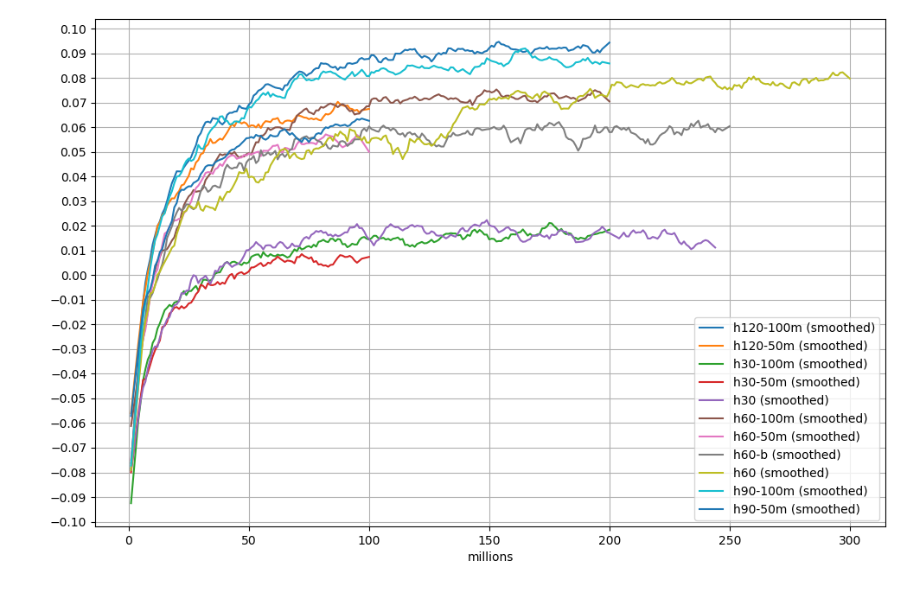

This repository contains backgammon nets and their training histories.

The first two, below, are from training sessions a long time ago, and
their training histories are not preserved here.  They originally used
a different file format but they have been converted for inclusion here.

The others provide their training histories here, in subdirectories whose
names correspond to the given network.

In any **.w** network file, the first line says what the network structure
is for that net, and you can consult the source code for details of
the inputs used, the net topology, etc., for that version.

The subdirectory for a given net also contains the script which was
used for training, and by consulting it you can see the schedule of
hyperparameters used.

Finally, the subdirectory should have a log of playoff performance and
perhaps a plot of it too, showing how the performance evolved.

Comments about strength relate to fast play with no lookahead.

* **early.w**: One of the nets from the early 1990s, which trained on about
         15 million games.  It is a competent but fairly weak player,
         and is sometimes useful to compare to other training
         experiments early in the process.

* **drc.w**: The network which was used with the Dr. Chouette GUI in the
       late 1990s.  A fairly strong player, trained about 64 million
       games, which back then took months.  We use this net as a
       common opponent when evaluating a net under training for
       performance.  We do not train against this net, only use it as
       an indicator of relative strength.  (All indications are that
       playing strength is mostly transitive.)  This net used to be
       called "good.w", and you might see that name in the playoff
       histories of some of the nets below.

* **h60.w**: A strong player, trained in 2020, 300 million games.

* **h90-100m-200.w**: A stronger player, trained as described below.

* **h120-100m-200.w**: Currently the best net we have.  Trained as described below.

Experiments
-----------

In these two experiments, lambda has been fixed at 0.85, and alpha starts at 0.001
and decays exponentially.  Halfway through each run, alpha has decayed
by a factor of 20, to 5e-5, and by the end of the run alpha has decreased
by a factor of 400, to 2.5e-6.

Each plot shows four differently-sized nets, all using the same
feature set as netv3, but differing in the number of hidden units as
indicated.

Every million training games a snapshot is taken, and a playoff of 100 thousand games
is done against a fixed opponenet, drc.w.

The foreground plot has been smoothed by a Savitzky-Golay first-order filter of width 7, and
the actual playoff scores are shown receded.


Given the typical variance of a single game in these nets (measured to
be about 1.7), the standard error for a 100-thousand trial is about
0.004 equity units, a little less than half a percent.  This is broadly
seen in the receded plots, and the smoothed plots are simply an efficient
way to simulate a larger playoff size.

If we increase the playoff games to 1 million, the standard error goes down
to about 0.001 equity units, allowing us to more-or-less believe tenths of
a percent in a playoff result.

Here are some playoff results at this higher 1-million game level:

```
white,black,trials,equity,sw,sl,gw,gl,bw,bl

h120-100m-200.w,  h90-100m-200.w, 1000000, 0.00426, 374197, 372751, 123159, 120154, 4337, 5402

h120-100m-200.w, h120-100m-100.w, 1000000, 0.00589, 376407, 374167, 120363, 118284, 5305, 5474
 h90-100m-200.w,  h90-100m-100.w, 1000000, 0.00602, 378826, 373728, 119789, 119052, 4211, 4394

 h90-100m-200.w,           drc.w, 1000000, 0.0853, 380673, 371115, 134072, 102416, 7928, 3796
h120-100m-200.w,           drc.w, 1000000, 0.0921, 380634, 370450, 135841,  99825, 8266, 4984

h120-200m-100.w, h120-100m-200.w, 1000000, 0.00787, 368683, 375175, 125308, 119137, 6185, 5512
h120-200m-133.w, h120-100m-200.w, 1000000, 0.013,   370482, 371635, 126206, 120989, 5957, 4731
h120-200m-149.w, h120-100m-200.w, 1000000, 0.007,   371571, 369583, 124811, 123314, 5696, 5025

```

This second plot shows the results for an experiment like the previous, but which concludes in
half the number of games.  Lambda is the same 0.85, and the rate of exponential decay of the
learning rate is such that it starts at 0.001 and still reaches 5e-5 at the halfway point, and
2.5e-6 at the end:


Other
-----

This plot shows the training progress of all the nets we have recently trained.


