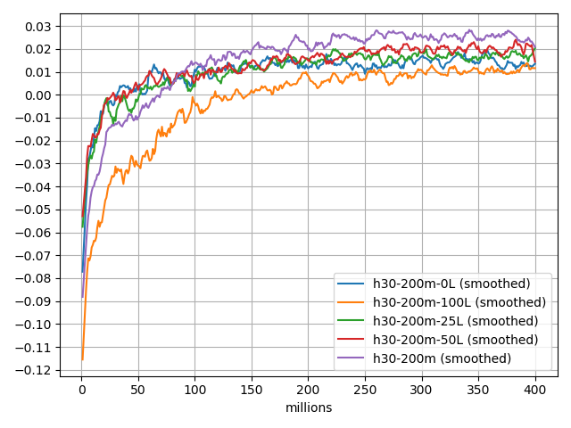

This repository contains backgammon nets and their training histories.

The first two, below, are from training sessions a long time ago, and
their training histories are not preserved here.  They originally used
a different file format but they have been converted for inclusion here.

The others provide their training histories here, in subdirectories whose
names correspond to the given network.

In any **.w** network file, the first line says what the network structure
is for that net, and you can consult the source code for details of
the inputs used, the net topology, etc., for that version.

The subdirectory for a given net also contains the script which was
used for training, and by consulting it you can see the schedule of
hyperparameters used.

Finally, the subdirectory should have a log of playoff performance and
perhaps a plot of it too, showing how the performance evolved.

Comments about strength relate to fast play with no lookahead.

* **early.w**: One of the nets from the early 1990s, which trained on about
         15 million games.  It is a competent but fairly weak player,
         and is sometimes useful to compare to other training
         experiments early in the process.

* **drc.w**: The network which was used with the Dr. Chouette GUI in the
       late 1990s.  A fairly strong player, trained about 64 million
       games, which back then took months.  We use this net as a
       common opponent when evaluating a net under training for
       performance.  We do not train against this net, only use it as
       an indicator of relative strength.  (All indications are that
       relative playing strength is mostly transitive.)  This net used to be
       called "good.w", and you might see that name in the playoff
       histories of some of the nets below.

* **h120-400m-500.w**: Among the best of the nets we trained.

Experiments
-----------

In these experiments, lambda has been fixed at 0.85, and alpha starts at 0.001
and decays exponentially.  Halfway through each run, alpha has decayed
by a factor of 20, to 5e-5, and by the end of the run alpha has decreased
by a factor of 400, to 2.5e-6.

Each plot shows four differently-sized nets, all using the same
feature set as netv3, but differing in the number of hidden units as
indicated.

Every million training games a snapshot is taken, and a playoff of 100 thousand games
is done against a fixed opponenet, `drc.w`.

The foreground plot has been smoothed by a Savitzky-Golay first-order filter of width 7, and
the actual playoff scores are shown receded.


Alpha decayed by a factor of 20 at 400 million games:


Alpha decayed by a factor of 20 at 200 million games:


Alpha decayed by a factor of 20 at 100 million games:


Alpha decayed by a factor of 20 at 50 million games:


Given the typical variance of a single game in these nets (measured to
be about 1.7), the standard error for a 100-thousand trial is about
0.004 equity units, a little less than half a percent.  This is broadly
seen in the receded plots, and the smoothed plots are simply an efficient
way to approximate a larger playoff size.

If we increase the playoff games to 1 million, the standard error goes down
to about 0.001 equity units, allowing us to more-or-less believe tenths of
a percent in a playoff result.

Here are some playoff results at this higher 1-million game level:

```
white,black,trials,equity,sw,sl,gw,gl,bw,bl

 h30-200m-200.w,           drc.w, 1000000, 0.0263, 374941, 389909, 119574, 102189, 7776, 5611
 h60-200m-200.w,           drc.w, 1000000, 0.0801, 376778, 375870, 134571, 100320, 8017, 4444
 h90-200m-200.w,           drc.w, 1000000, 0.101,  379074, 366493, 139647, 102016, 8521, 4249
h120-200m-200.w,           drc.w, 1000000, 0.105,  374360, 364899, 144597, 102928, 8653, 4563

# Mostly transitive.
h120-200m-200.w,  h90-200m-200.w, 1000000, 0.0051, 363932, 369848, 131129, 125103, 4822, 5166
 h90-200m-200.w,  h60-200m-200.w, 1000000, 0.0212, 377278, 366260, 125482, 121257, 5154, 4569
h120-200m-200.w,  h60-200m-200.w, 1000000, 0.0277, 372616, 364886, 131111, 121425, 5074, 4888
```

The hump we see on h120-400m and h90-400m is real:
```
h120-400m-500.w, h120-400m-800.w, 1000000,  0.00623,  372436, 373318, 124022, 120546, 4865, 4813
 h90-400m-500.w, h90-400m-800.w,  1000000,  0.00685,  367983, 370693, 127461, 123543, 5448, 4872

 h60-400m-500.w, h60-400m-800.w,  1000000,  0.000741, 374934, 373328, 120933, 120986, 4783, 5036
 h30-400m-500.w, h30-400m-800.w,  1000000, -0.00301,  384600, 382256, 110281, 112586, 5014, 5263
```

Another hump, perhaps:
```
h120-200m-250.w, h120-200m-400.w, 1000000, 0.00151, 368278, 370222, 126601, 125000, 4992, 4907
h120-200m-250.w, h120-200m-200.w, 1000000, 0.00619, 367896, 365019, 129032, 128001, 5234, 4818

```

We see from the `h120-400m` plot that it seems to peak about `5/8` of the way through, at 500
million games.  The value of alpha here is close to `2.5e-5`.
Among the best we currently have:
```
h120-400m-500.w, h120-400m-800.w, 1000000,  0.00623, 372436, 373318, 124022, 120546, 4865, 4813
h120-400m-500.w, h120-400m-400.w, 1000000,  0.00365, 370746, 369058, 125483, 124599, 5090, 5024

h120-400m-500.w, h120-200m-250.w, 1000000,  0.0035, 374619, 369269, 122383, 123812, 5126, 4791
h120-400m-500.w, h120-200m-200.w, 1000000,  0.0121,  372830, 362496, 126895, 127468, 5640, 4671

h120-400m-500.w,  h90-400m-500.w, 1000000,  0.00888, 371911, 367004, 125806, 124911, 5548, 4820
h120-400m-500.w,           drc.w, 1000000,  0.116,   384388, 363629, 139918,  99157, 8807, 4101

```

The reason for the drop-off with additional training on the
`h120-400m` and `h90-400m` nets is not yet understood, but it is not
totally surprising that a form of over-learning can occur here.

One possibility is that something numerical is happening with the net
over time, perhaps the overall magnitude is growing excessively, because
we do not use any form of regularization.

Or it could be devoting resources to ever-more-accurate equity calculations
for the opening positions it sees over and over.  More generally, it
should be kept in mind that the net is trained to increase its
accuracy in equity estimation, and better quality of play usually results.
But it is conceivable that the net is getting better at estimating its
play as it gets a little worse, and there is no reason to rule that
out.

Finally, another possibility is that the fall-off is related
more to the decreasing alpha than to the quantity of training, and
that with a small-enough alpha perhaps the net is getting into a hole
that it cannot get itself out of.

These are just speculations, and further investigation is merited.

Regardless, these experiments yield what looks to be a very good player,
at least for no-lookahead play: `h120-400m-500.w`.  That should be our
default player until we can create a better one.

### Future directions ###

The nets in all of these experiments had essentially the same
topology, and differed only in the number of hidden units.  Size
matters a lot, and the original `h30` nets were too small: we got a
big improvement by doubling, then doubling again.  There seems little
doubt that making the net even bigger would result in more
improvement, although they are getting slow to train.  Nevertheless,
it could be done easily.

Another direction is to investigate essentially different network
topologies.  We have several in mind and the code base is getting to
the point where these can be investigated conveniently.  There is
still work to do on the codebase though.

Yet another direction is batching.  These training sessions update the
weights after each training game.  We could instead, for example,
accumulate the updates and update the net after 100 games, or some
other number.  Doing that would likely change the learning rate we
should use, and in particular I think we would probably increase it
signficantly.  Batching might work better, for reasons similar to why
classification nets train better with batching.  Batching in this way
would also allow us to parallelize the training significantly on the
conventional-core machines we use.

It is also important to re-implement the lookahead play that we used
to have in the codebase, and see to what extent the play improves when
using so-called two-ply equity estimation.


Plots by Network Size
---------------------


Varying Lambda
--------------

The net `h60-200m-200.w` was trained according to the `200m` alpha schedule and with lambda equal to `0.85`.
Playoffs against nets trained with other fixed values of lambda are as indicated.

```
white,black,trials,equity,sw,sl,gw,gl,bw,bl
h60-200m-200.w, h60-200m-50L-200.w,  1000000, 0.00142, 370333, 377440, 122724, 118897, 5449, 5157
h60-200m-200.w, h60-200m-25L-200.w,  1000000, 0.00589, 374059, 375443, 121800, 119148, 5103, 4447
h60-200m-200.w, h60-200m-0L-200.w,   1000000, 0.00604, 373574, 369626, 123779, 122564, 5172, 5285
h60-200m-200.w, h60-200m-100L-200.w, 1000000, 0.0191,  374003, 374033, 125074, 116310, 5559, 5021
```


So our historical use of lambda equal to `0.85` is justified at least for this learning schedule,
although it is possible that the results would vary if re-run.

A similar experiment for `h30` nets yields results that are somewhat different.  The value of `0.85` for
lambda is still the best, but the other values are significantly worse.



